# Quantum Information Bootcamp: Logic Gates Summary  🛠️

## 🌐 Introduction

Logic gates are fundamental building blocks of digital circuits, serving as the basis for all computational processes in both classical and quantum computing. These gates process binary inputs (0s and 1s) to produce specific outputs, enabling complex calculations and decision-making. While classical logic gates have been widely used for decades, the emergence of quantum computing introduces a new paradigm that harnesses quantum properties for unprecedented computational power.

## 🎯 Goals

- 🧠 **Understand the Essence:** Grasp the core principles of classical logic gates.
- ⚛️ **Explore Quantum Logic:** Delve into the unique operations of quantum logic gates.
- 🌌 **Bridge the Divide:** Unearth the bonds and distinctions between classical and quantum logic systems.

## 📚 Lessons

### 1.Logic Gates

 #### Circuit Diagram : 
 
A classical logic gate is represented in circuit diagrams by a generic box with inputs and outputs. 
   
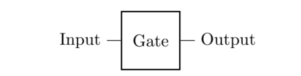   
   
These diagrams are read from left to right. The input bit on the left travels along a line or wire into the gate's input terminal. Inside the gate, specific logic operations are performed based on the gate type. Then, a bit emerges from the gate's output terminal, traveling along another line as the output.

For example, consider the NOT gate. In its circuit diagram, you would have a single input line connected to the left side of the NOT gate symbol, and a single output line emerging from the right side of the symbol. The NOT gate's truth table indicates that it takes an input of 0 and produces an output of 1, and vice versa.
   
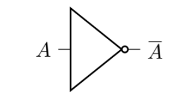
   
#### Truth Table :
The truth table of a logic gate illustrates its behavior for all possible input combinations. It provides a clear mapping between input values and the resulting output. Each row in the truth table represents a specific input combination, and the corresponding output is recorded. This table helps us understand the logic function performed by the gate.   

| input | output |
|:----:|:---:|
|  0   |  ?  | 
|  1   |  ?  | 

   
For example, the truth table of a NOT gate would show that when the input is 0, the output is 1, and vice versa. Similarly, an AND gate's truth table demonstrates that it produces a 1 output only when both inputs are 1.   

| input | output |
|:----:|:---:|
|  0   |  1  | 
|  1   |  0  | 
   
- ### Single-Bit Gates: Identity and NOT Gates**
  The simplest logic gates take one bit as input and then outputs one bit.
     
 **1. Identity Gate:**
   The Identity gate, often denoted as "I," is a fundamental gate that doesn't alter the input. In a circuit diagram, it's represented as a box with an input line on the left and an output line on the right. When an input bit travels into the Identity gate, it passes through unchanged, emerging as the output bit on the other side. The Identity gate's truth table showcases that for every input value (0 or 1), the output is identical, hence the name "Identity."   
   **Example Circuit Diagram :**
  
  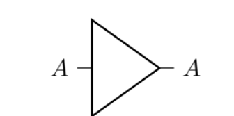
     
  Since the identity gate does nothing, we often omit the triangle and just draw a
  longer wire
  
  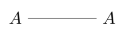

   **Example Truth Table:**
   | Input | Output |
   |-------|--------|
   |   0   |   0    |
   |   1   |   1    |

   This simple gate serves as a reference point for other gates and operations in both classical and quantum computing circuits.

**2. NOT Gate:**
   - **Circuit Diagram and Truth Table Explanation:**
   The NOT gate, also known as the inversion gate, is represented in a circuit diagram by a box with a single input line on the left and a single output line on the right. When an input bit travels into the NOT gate, it undergoes a logical inversion – 0 becomes 1, and 1 becomes 0 – which is reflected in the output bit on the right.

 **Example Circuit Diagram :**   
  

      
   **Example Truth Table:**
   | Input | Output |
   |-------|--------|
   |   0   |   1    |
   |   1   |   0    |

   The NOT gate's truth table reveals its behavior of flipping the input bit's value. It's a basic yet essential gate used in various logical and computational operations.

- **Two-Bit Gates: AND, NAND, OR, XOR**
  A two-bit logic gate takes two bits as input, say A and B Although a two-bit logic
gate can have multiple outputs, the simplest case just has one output. So, its circuit
diagram and truth table would look like
   
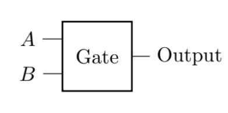
   
| A B | output |
|:----:|:---:|
| 0 0  |  ?  | 
| 0 1  |  ?  | 
| 1 0  |  ?  | 
| 1 1  |  ?  | 

**1. AND Gate:**
   - **Circuit Diagram and Truth Table Explanation:**
   The AND gate is a fundamental logic gate that performs the logical AND operation on two input bits. In a circuit diagram, it's represented as a box with two input lines on the left and a single output line on the right. When both input bits are 1, the AND gate produces an output of 1; otherwise, it produces an output of 0.
   
 **Example Circuit Diagram :**      
  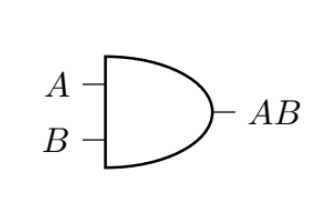
      
   **Example Truth Table:**
   | Input A | Input B | Output |
   |---------|---------|--------|
   |    0    |    0    |   0    |
   |    0    |    1    |   0    |
   |    1    |    0    |   0    |
   |    1    |    1    |   1    |

   The truth table illustrates that the AND gate only outputs 1 when both input bits are 1.

**2. NAND Gate:**
   - **Circuit Diagram and Truth Table Explanation:**
   The NAND gate is the logical complement of the AND gate. It produces an output of 0 when both input bits are 1, and it produces an output of 1 for all other input combinations. In a circuit diagram, the NAND gate is represented similarly to the AND gate.
   
 **Example Circuit Diagram :**   
  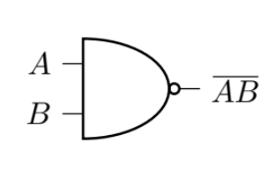
      
   **Example Truth Table:**
   | Input A | Input B | Output |
   |---------|---------|--------|
   |    0    |    0    |   1    |
   |    0    |    1    |   1    |
   |    1    |    0    |   1    |
   |    1    |    1    |   0    |

   The truth table demonstrates that the NAND gate is the opposite of the AND gate's behavior.

**3. OR Gate:**
   - **Circuit Diagram and Truth Table Explanation:**
   The OR gate performs the logical OR operation on two input bits. Its circuit diagram consists of two input lines on the left and a single output line on the right. The OR gate produces an output of 1 if at least one of the input bits is 1.
   
 **Example Circuit Diagram :**   
  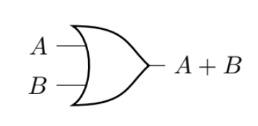
      
   **Example Truth Table:**
   | Input A | Input B | Output |
   |---------|---------|--------|
   |    0    |    0    |   0    |
   |    0    |    1    |   1    |
   |    1    |    0    |   1    |
   |    1    |    1    |   1    |

   The truth table demonstrates that the OR gate outputs 1 whenever at least one input bit is 1.

**4. XOR Gate:**
   - **Circuit Diagram and Truth Table Explanation:**
   The XOR (exclusive OR) gate outputs 1 when the two input bits are different (one 0 and one 1), and it outputs 0 when the input bits are the same (both 0 or both 1). In a circuit diagram, it's represented like other gates with two inputs and one output.
   
 **Example Circuit Diagram :**   
  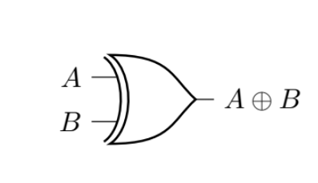
      
   **Example Truth Table:**
   | Input A | Input B | Output |
   |---------|---------|--------|
   |    0    |    0    |   0    |
   |    0    |    1    |   1    |
   |    1    |    0    |   1    |
   |    1    |    1    |   0    |

   The truth table illustrates the behavior of the XOR gate in differentiating between identical and different input bits.

**5. Quantum Logic Gates:**

**Introduction to Quantum Bits (Qubits) and Superposition:**   
   
   Quantum bits, or qubits, are the fundamental units of quantum information. Unlike classical bits that can only represent 0 or 1, qubits can exist in a superposition of states, representing both 0 and 1 simultaneously. This unique property enables quantum computers to perform complex calculations more efficiently for certain problems.
   
**Quantum Gates as Unitary Transformations:**  
   
   Quantum gates are operators that transform the state of qubits. These gates are represented by unitary matrices, ensuring that they preserve the quantum state's normalization and reversibility. Unitary transformations are key to maintaining the quantum nature of computations.
   

**Quantum I Gate (Identity Gate): Preserving Qubit States:**
   
   The Quantum I gate, also known as the Identity gate, is a unitary operator that doesn't change the state of a qubit. Applying the I gate to a qubit results in no change; it's like a placeholder gate used in quantum circuits.
   
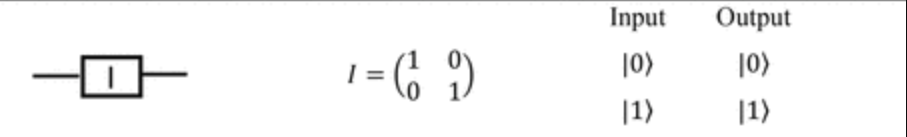
   

<table>
  <tr>
    <th>Input</th>
    <th>Output</th>
  </tr>
  <tr>
    <td>|0></td>
    <td>|0></td>
  </tr>
  <tr>
    <td>|1></td>
    <td>|1></td>
  </tr>
</table>
    
**Quantum Hadamard Gate: Superposition Generator:**   
   
   The Hadamard gate, often denoted as "H," is a foundational gate in quantum computing. It generates superposition by transforming the qubit's state into an equal-weighted combination of |0⟩ and |1⟩. Mathematically, the Hadamard gate maps |0⟩ to (|0⟩ + |1⟩) / √2 and |1⟩ to (|0⟩ - |1⟩) / √2. This gate plays a crucial role in quantum algorithms, including quantum searching and quantum key distribution.   
      
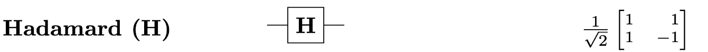
   

   <table>
  <tr>
    <th>Input</th>
    <th>Output</th>
  </tr>
  <tr>
    <td>|0></td>
    <td> 1 / √2  (|0⟩ + |1⟩)</td>
  </tr>
  <tr>
    <td>|1></td>
    <td>1 / √2  (|0⟩ - |1⟩)</td>
  </tr>
</table>
   
   
**Quantum X Gate : Flipping Qubit States:**   
   
   The quantum flip gate, often referred to as the X gate, flips the state of a qubit. If the qubit is in state |0⟩, applying the X gate transforms it into state |1⟩, and vice versa. The X gate corresponds to a rotation around the X-axis on the Bloch sphere representation of qubits.   

      
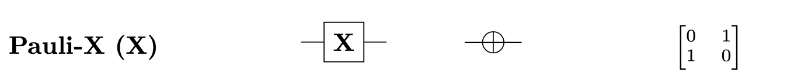
   

   <table>
  <tr>
    <th>Input</th>
    <th>Output</th>
  </tr>
  <tr>
    <td>|0></td>
    <td>|1></td>
  </tr>
  <tr>
    <td>|1></td>
    <td>|0></td>
  </tr>
</table>
    
   
**Quantum Z Gate: Phase Shift Operator:**  
   
   The Z gate, represented as "Z," introduces a phase shift of π radians (180 degrees) to the qubit's state. It doesn't change the probabilities of measuring 0 or 1, but it imparts a relative phase between the two states. Mathematically, the Z gate maps |0⟩ to |0⟩ and |1⟩ to -|1⟩. The Z gate's effect becomes evident in interference patterns during quantum algorithms.   
      
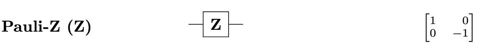

 
  <table>
  <tr>
    <th>Input</th>
    <th>Output</th>
  </tr>
  <tr>
    <td>|0></td>
    <td>|0></td>
  </tr>
  <tr>
    <td>|1></td>
    <td>-|1></td>
  </tr>
</table>
        
**Quantum Controlled Gates:**  
   
   Quantum Controlled operations are achieved through controlled gates. A common example is the Controlled-NOT (CNOT) gate. It acts on two qubits: a control qubit and a target qubit. If the control qubit is in state |1⟩, the target qubit's state is flipped. This gate enables entanglement, a phenomenon crucial for quantum parallelism and quantum algorithms.
   
 **Quantum CNOT Gate: Creating Quantum Correlations:** 
    
   The CNOT gate, or controlled-X gate, acts as a quantum XOR gate. It flips the target qubit's state if the control qubit is in state |1⟩. The CNOT gate is essential for creating entanglement and quantum correlations between qubits, which form the basis of quantum algorithms.
      
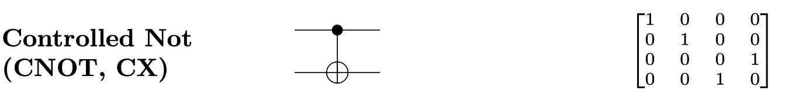

<table>
  <tr>
    <th>Control</th>
    <th>Target</th>
    <th>Output</th>
  </tr>
  <tr>
    <td>|0></td>
    <td>|0></td>
    <td>|0⟩</td>
  </tr>
  <tr>
    <td>|0></td>
    <td>|1></td>
    <td>|1⟩</td>
  </tr>
  <tr>
    <td>|1></td>
    <td>|0></td>
    <td>|1⟩</td>
  </tr>
  <tr>
    <td>|1></td>
    <td>|1></td>
    <td>|0⟩</td>
  </tr>
</table>

    
**Measurement: Extracting Classical Information:**   
   
The measurement is not a gate it uesed extracts classical information from a quantum state. When applied to a qubit, it collapses the qubit's superposition into either the state |0⟩ or |1⟩ based on probabilities determined by the qubit's amplitudes. Measurement is a fundamental aspect of quantum computing, as it provides the output of quantum algorithms.
   
**Quantum Operations and Their Matrices:**   
   
   Quantum gates are represented by matrices that describe their effects on qubit states. For example, the X gate is represented by the Pauli-X matrix. These matrices enable precise control and manipulation of qubit states during quantum computations.
   
**Quantum Circuits: Arranging Gates for Computations:** 
   
   Quantum circuits are sequences of quantum gates applied to qubits to perform specific computations. Gates are arranged in a particular order, forming a quantum algorithm. Quantum circuits allow for the execution of complex operations with minimal decoherence and error.

**quantum circuit**

  A quantum circuit is a sequence of quantum gates arranged to perform specific computations. Quantum gates are applied to qubits in a specific order to create a quantum algorithm. Quantum circuits offer a visual representation of quantum algorithms, where each gate's action is represented as a step in the circuit.

   
**Comparing Classical and Quantum Gates:**   

**Key Differences between Classical and Quantum Computing:**   
   
   Classical computing relies on classical bits (0s and 1s) and processes information sequentially using logic gates. Quantum computing leverages qubits' unique properties, such as superposition and entanglement, allowing for more efficient parallel processing of multiple possibilities simultaneously.
   
**Classical vs. Quantum Bit Representation:**   
   
   Classical bits can only be in states 0 or 1. In quantum computing, qubits can exist in superpositions of states, representing both 0 and 1 at the same time. This expanded representation underpins quantum computation's power.
   
**Quantum Parallelism and Exponential Speedup:**   
   
   Quantum computing harnesses quantum parallelism, enabling it to process a vast number of possibilities in parallel. This property allows quantum algorithms to solve specific problems exponentially faster than classical counterparts.
   
**No-Cloning Theorem and Its Implications:**  
   
   The no-cloning theorem states that an arbitrary unknown quantum state cannot be cloned exactly. This has profound implications for quantum cryptography and computing, as it prevents unauthorized copying of quantum information.
   
**Quantum Entanglement and Its Significance:**  
   
   Quantum entanglement is a phenomenon where qubits become correlated in such a way that the state of one qubit is intrinsically tied to the state of another, even at a distance. This non-local correlation has applications in secure communication and quantum computing algorithms.

## 📜 Summary

The Quantum Information Bootcamp: Logic Gates provides a comprehensive exploration of logic gates in both classical and quantum computing. It introduces the foundational concepts of logic gates, their circuit diagrams, and truth tables. The journey begins by uncovering the basics of single-bit gates, including the Identity gate and the NOT gate. It then advances to two-bit gates like AND, NAND, OR, and XOR, each with its distinct behavior illustrated through circuit diagrams and truth tables.

Transitioning into the quantum realm, the bootcamp dives into quantum bits (qubits) and their remarkable superposition property. Quantum gates, presented as unitary transformations, are examined in detail. The Quantum NOT gate (X gate) is unveiled as a qubit state flipper, while controlled gates, such as the CNOT gate, pave the way for entanglement. The Quantum XOR gate's (CNOT gate's) role in creating quantum correlations is explained.

The Hadamard gate emerges as a superposition generator, producing equal-weighted quantum states. The Z gate introduces phase shifts, and quantum circuits are introduced as sequences of gates arranged to execute computations. Measurement, a fundamental aspect of quantum computing, is explored for extracting classical information from qubits.

A comparison between classical and quantum gates highlights the pivotal distinctions, including quantum parallelism, exponential speedup, the no-cloning theorem, and the phenomenon of entanglement. The bootcamp culminates in a rich understanding of logic gates' pivotal role in quantum computing's revolution across various fields, opening doors to novel applications and tackling challenging problems.

Through detailed explanations, visual aids, and insightful examples, this Quantum Information Bootcamp equips you with the knowledge to navigate the intricate world of logic gates, setting the stage for further exploration into the depths of quantum information and computation.

## 🔗 References

1. [Logic Gates - Wikipedia](https://en.wikipedia.org/wiki/Logic_gate)
2. [introduction to classical and quantum computing](https://plato.stanford.edu/entries/qt-quantcomp/](https://www.thomaswong.net/introduction-to-classical-and-quantum-computing-1e3p.pdf))

Feel free to explore these references for further reading on logic gates and quantum computing .
